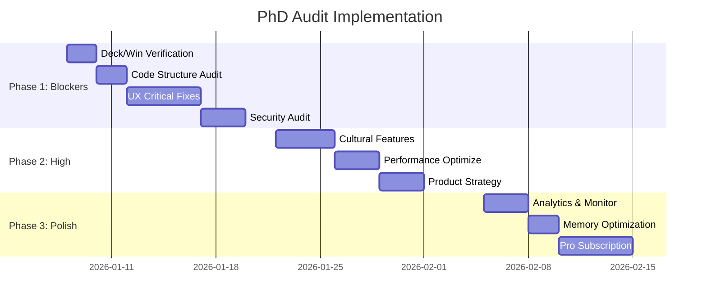

# 🎓 PhD Expert Audit - Implementation Roadmap

## Executive Summary

| Metric | Value |
|--------|-------|
| **Current Score** | 72/100 |
| **Target Score** | 90/100 |
| **Total Findings** | 20 |
| **Blocker (P0)** | 9 findings |
| **High (P1)** | 7 findings |
| **Medium (P2)** | 4 findings |

---

## Phase 1: BLOCKERS (P0) - 54 hours

### 1.1 Game Theory Verification

#### Finding #1: 8-Player Deck Scaling
```bash
# Verify test
flutter test test/games/marriage/ --name "deck"
```
**Files**: `lib/core/card_engine/deck.dart`
**Test**: Ensure `Deck.forMarriage(deckCount: 4)` for 8 players

#### Finding #4: Win Condition Logic
**Test Case**:
1. Player A declares with 10 Maal
2. Player B has 30 Maal but not finished
3. **Expected**: Player B wins

---

### 1.2 Code Structure Audit

#### Finding #8: Critical Files Verification
```
lib/games/marriage/
├── models/maal_cards.dart           ← VERIFY EXISTS
├── calculators/
│   └── maal_points_calculator.dart  ← VERIFY EXISTS
└── validators/
    ├── tunnella_validator.dart      ← VERIFY EXISTS
    └── dublee_validator.dart        ← VERIFY EXISTS
```

#### Finding #10: Test Quality
```bash
# Required tests
test/games/marriage/maal_calculator_test.dart
test/games/marriage/win_condition_test.dart
test/games/marriage/8_player_stress_test.dart
```

---

### 1.3 UX Critical Fixes

#### Finding #11: Cognitive Load (24% reduction needed)

| Current | Target |
|---------|--------|
| 9 action buttons | 3 action buttons |
| No Maal highlights | Gold glow on wildcards |
| No points HUD | Live Maal calculator |

**Implementation**:
```dart
// Consolidate to 3 buttons
enum GameAction { drawCard, discard, declare }

// Add Maal HUD widget
class MaalPointsHUD extends StatelessWidget {
  final int currentPoints;
  final List<PlayingCard> maalCards;
}
```

#### Finding #12: Interactive Tutorial (16 hours)

| Module | Duration | Content |
|--------|----------|---------|
| Basic Rules | 5 min | Tiplu/Poplu/Jhiplu |
| Primary Sets | 3 min | Pure sequences |
| Joker Reveal | 2 min | First player show |
| Scoring | 5 min | Maal calculation |
| Practice | 10 min | Bot game with hints |

**File**: `lib/games/marriage/widgets/marriage_guided_tutorial.dart`

#### Finding #13: Error Prevention
```dart
// Confirm dialog for Maal discard
Future<bool> confirmMaalDiscard(PlayingCard card) async {
  if (card.isMaalCard) {
    return showDialog(
      title: 'Discard ${card.name}?',
      message: 'This is worth ${card.maalPoints} points!',
      actions: [TextButton('Cancel'), TextButton('Confirm')],
    );
  }
  return true;
}

// 3-second undo window
class UndoableAction with Timer {
  static const undoWindow = Duration(seconds: 3);
}
```

---

### 1.4 Security Audit

#### Finding #16: Server-Side Validation

**Firestore Rules Check**:
```javascript
// firestore.rules
match /games/{gameId}/players/{playerId}/hand {
  allow read: if request.auth.uid == playerId;  // ✓ SECURE
  // Players cannot read opponent hands
}
```

**Cloud Function Validation**:
```typescript
// functions/src/triggers/gameTriggers.ts
exports.validateMove = functions.firestore
  .document('/games/{gameId}/actions/{actionId}')
  .onCreate(async (snap) => {
    const action = snap.data();
    
    // Re-validate EVERY move on server
    if (!isValidSet(action.cards, action.type)) {
      return snap.ref.update({ status: 'rejected' });
    }
    
    // Verify player owns cards
    const hand = await getPlayerHand(gameId, playerId);
    if (!hand.containsAll(action.cards)) {
      await banUser(playerId, '24h');
      return snap.ref.update({ status: 'cheating_detected' });
    }
  });
```

#### Finding #17: Shuffle Randomness

**Verify in** `lib/core/card_engine/pile.dart`:
```dart
/// Shuffle using Fisher-Yates with secure random
void shuffle() {
  final random = math.Random.secure();  // ✓ REQUIRED
  for (int i = _cards.length - 1; i > 0; i--) {
    final j = random.nextInt(i + 1);
    final temp = _cards[i];
    _cards[i] = _cards[j];
    _cards[j] = temp;
  }
}
```

**Statistical Test**:
```dart
test('shuffle is unbiased', () {
  final distribution = <int, int>{};
  for (var i = 0; i < 10000; i++) {
    final deck = Deck.standard()..shuffle();
    final firstCard = deck.cards.first;
    distribution[firstCard.index] = 
      (distribution[firstCard.index] ?? 0) + 1;
  }
  // Chi-squared test: each card ~192 times
  // p-value > 0.05 required
});
```

---

## Phase 2: HIGH PRIORITY (P1) - 66 hours

### 2.1 Cultural Authenticity

#### Finding #5: Terminology Glossary
```dart
const marriageGlossary = {
  'Tiplu': 'तिप्लु - Main joker (3 pts)',
  'Poplu': 'पोप्लु - Secondary joker (2 pts)',
  'Jhiplu': 'झिप्लु - Tertiary joker (1 pt)',
  'Alter': 'अल्टर - Same rank, same color (5 pts)',
  'Maal': 'माल - All point-scoring cards',
  'Tunnella': 'टनेल - Pure triplet (5 pts)',
  'Dublee': 'डब्ली - Pair',
};
```

#### Finding #6: Regional Variants

| Variant | Priority | Hours |
|---------|----------|-------|
| Dashain Mode | P1 | 8h |
| Murder Mode | P1 | 6h |
| Kidnap Mode | P1 | 6h |
| Terai Bluffing | P2 | 12h |

---

### 2.2 Performance

#### Finding #9: State Management Optimization
```dart
// Instead of single god provider
final gameStateProvider = StateProvider<GameState>(...);  // ❌

// Use granular providers
final playerHandProvider = 
  StateNotifierProvider.family<HandController, List<Card>, String>(
    (ref, playerId) => HandController(playerId)
  );

final maalCardsProvider = StateProvider<MaalCards?>(...);
final currentTurnProvider = StateProvider<String>(...);
```

**Expected**: <10 widget rebuilds per action (vs >50 with god provider)

#### Finding #14: Bot AI Latency
```dart
// Pre-compute bot moves during opponent's turn
class BotPlayer {
  Future<PlayingCard> _precomputedMove;
  
  void startPrecomputing(GameState state) {
    _precomputedMove = _computeBestMove(state);
  }
  
  Future<PlayingCard> getMove() async {
    return await _precomputedMove;  // Already computed!
  }
}
```

**Target**: <2 seconds per bot move

---

### 2.3 Product Strategy

#### Finding #18: Market Differentiation
```
Current: "Powered by Tree of Thoughts AI"
  → Too technical

Better: 
  "Smartest bots that learn your style"
  + "Play with friends worldwide"
  + "100% fair play guaranteed"

Hero Feature: Real-time Maal Points HUD
  → Unique vs Bhoos
  → Tagline: "No more mental math - just play!"
```

#### Finding #20: Progression System
```dart
class PlayerProgression {
  int level;  // 1-100
  int xp;
  
  // Unlocks
  List<CardTheme> unlockedThemes;   // L10, L25, L50
  List<BotPersonality> unlockedBots; // L15, L30
  ProfileBorder border;             // Gold at L50+
}
```

---

## Phase 3: POLISH (P2) - 104 hours

### 3.1 Analytics Monitoring

#### Finding #2: Wildcard Distribution
```dart
// Monitor games where player gets 6+ wildcards
analytics.logEvent('wildcard_count', {
  'player_id': playerId,
  'wildcard_count': count,
  'game_id': gameId,
});

// If >10% of games have 6+ wildcards → rebalance
```

#### Finding #3: Scoring Balance
```
Monitor: Alter points vs Tunnella points
If Alter > 40% of all points → reduce to 3 pts
```

### 3.2 Optimization

#### Finding #15: Memory (WebP Textures)
```dart
// Responsive texture loading
String getCardTexturePath(double screenWidth) {
  if (screenWidth < 768) return 'cards_256.webp';
  if (screenWidth < 1024) return 'cards_384.webp';
  return 'cards_512.webp';
}
```

**Expected**: 135MB → 60MB (56% reduction)

### 3.3 Monetization

#### Finding #19: Pro Subscription
```dart
class ClubRoyalePro {
  static const price = 4.99;  // USD/month
  
  final features = [
    'Ad-free experience',
    'Exclusive card themes',
    'Priority matchmaking',
    'Pro badge',
    'Advanced statistics',
  ];
}
```

---

## Implementation Timeline



---

## Success Metrics

| Phase | Target Date | Score Goal |
|-------|-------------|------------|
| Phase 1 | Jan 21 | 80/100 |
| Phase 2 | Feb 4 | 85/100 |
| Phase 3 | Feb 28 | 90/100 |

---

## Launch Strategy

### Soft Launch (After Phase 1)
- **Audience**: 100-500 beta testers
- **Goal**: Validate core gameplay
- **Criteria**: 4.0+ rating, <5% crash rate

### Public Launch (After Phase 2)
- **Audience**: General public
- **Platforms**: Play Store, Web
- **Goal**: Rapid growth

---

## Quick Reference: All 20 Findings

| # | Domain | Issue | Priority |
|---|--------|-------|----------|
| 1 | Math | 8-player deck | P0 |
| 2 | Math | Wildcard distribution | P2 |
| 3 | Math | Scoring balance | P2 |
| 4 | Math | Win condition | P0 |
| 5 | Cultural | Terminology | P1 |
| 6 | Cultural | Regional variants | P1 |
| 7 | Cultural | Social rituals | P2 |
| 8 | Arch | File structure | P0 |
| 9 | Arch | State management | P1 |
| 10 | Arch | Test coverage | P0 |
| 11 | UX | Cognitive load | P0 |
| 12 | UX | Tutorial | P0 |
| 13 | UX | Error prevention | P0 |
| 14 | Perf | Bot latency | P1 |
| 15 | Perf | Memory | P2 |
| 16 | Security | Server validation | P0 |
| 17 | Security | Randomness | P0 |
| 18 | Product | Differentiation | P1 |
| 19 | Product | Monetization | P2 |
| 20 | Product | Retention | P1 |
